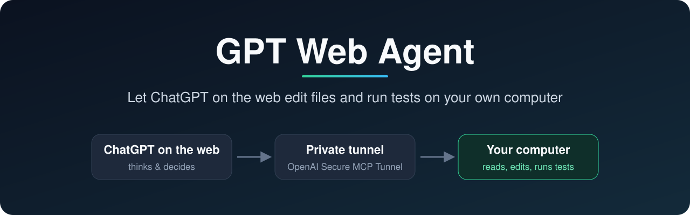

<p align="center">
  
</p>

<p align="center">
  <a href="https://www.npmjs.com/package/gpt-web-agent"></a>
  <a href="https://github.com/yyyqt/gpt-web-agent/actions/workflows/ci.yml"></a>
  
  
  <a href="LICENSE"></a>
</p>

<p align="center">
  <a href="README.zh-CN.md">中文</a> · <b>English</b> · <a href="docs/GETTING-STARTED.md">Setup guide with screenshots</a>
</p>

---

## What is this?

When you code with ChatGPT today, it hands you a snippet; you copy it, paste it, run it, and paste the error back.

**GPT Web Agent removes that loop.** Install it on your computer and ChatGPT on the web can read your project, edit files and run tests itself, then tell you what happened. You just talk in the chat:

```text
You:   Look at my blog project and tell me what could be improved. Analysis only.
GPT:   [reads package.json, src/…] Found 3 issues: ① homepage images aren't compressed ② …
You:   Fix the first one and run the tests.
GPT:   [edits src/image.js] [runs npm test] Tests pass. Changed 2 files: …
```

It's a small program (an MCP server) running on your computer, connected to your ChatGPT through OpenAI's official private tunnel. **ChatGPT does the thinking; this program does the work on your machine.**

## Why use it?

|  | Copy and paste | GPT Web Agent |
| --- | --- | --- |
| Editing code | You copy and paste | GPT edits the files |
| Running tests | You run them and paste errors back | GPT runs them and reads the results |
| Understanding a project | You pick files to paste | GPT finds and reads them |
| Generated images | Download, then move them yourself | One sentence saves them into your project |

- **Uses the ChatGPT you already have**: this project calls no model API, adds no per-token charges, and doesn't need Codex or any other AI tool.
- **No project setup**: say "now look at the YYY project" and it switches. No paths to register.
- **No accidental overwrites**: every write checks a content fingerprint (SHA-256) and refuses if you changed the file in the meantime.
- **Keeps running when you close the tab**: tests and builds already started keep running on your computer; ask for the result later.
- **Leaves your account alone**: no ChatGPT proxying, no browser cookies, only OpenAI's official tunnel.

## Quick start

> [!IMPORTANT]
> Use a **personal** account and check two things first: ChatGPT **Settings → Security and login** has **Developer mode**, and [Platform → Tunnels](https://platform.openai.com/settings/organization/tunnels) lets you click **Create tunnel**. A ChatGPT subscription does not by itself grant tunnel access; company or school accounts usually need an admin.

**1. Install** (Node.js 22+, macOS or Linux)

```sh
npm install --global gpt-web-agent
```

**2. Create a tunnel and a key in OpenAI Platform**

- [Tunnels](https://platform.openai.com/settings/organization/tunnels) → **Create tunnel**, link your ChatGPT workspace, and copy the `tunnel_...` ID.
- [API keys](https://platform.openai.com/settings/organization/api-keys) → **Create new secret key**, set permissions to **Restricted**, and grant only **Tunnels → Read** and **Use**.

**3. Connect your computer**

```sh
gpt-web-agent connect
```

Paste the tunnel ID and key when asked; type `YES` at the second prompt if you want GPT to run tests. Keep the terminal open once you see `tunnel-client started`. After every restart, this one command is all you need.

**4. Add the connection in ChatGPT**

Turn on developer mode → on the [plugins page](https://chatgpt.com/plugins), click **+ → Create app → Create MCP app** → choose **Tunnel** and **No Authentication**, tick the risk checkbox → create. In a new chat, select it from the **+** menu next to the message box, and you're ready.

Screenshots of every screen, success checks and troubleshooting are in the **[setup guide](docs/GETTING-STARTED.md)**.

## What it can do

| Capability | Details |
| --- | --- |
| Browse and search | List folders, read files, full-text search |
| Edit files | Create, rewrite or patch, with overwrite protection |
| Run commands | Tests, builds, installs; check progress, time out or cancel (enable during setup) |
| Save images | Store images generated or uploaded in the chat directly in your project |
| Task notes | Progress checkpoints for multi-step work that survive reconnects |
| Delegate to Codex | Optional: hand a task to local Codex when you explicitly ask |

## Safety

> [!WARNING]
> With commands enabled, anything GPT runs has **the same power as commands you type in your own terminal**. It is not a sandbox. Use it only with your own connection; for sensitive projects you can leave commands off and use file tools only.

- The runtime key lives in the macOS Keychain or the Linux system password store, never in config files or the repository.
- The connection goes only through OpenAI's official private tunnel; no port is opened to the internet. **Never** expose the local server to the internet yourself.
- See the [security notes](SECURITY.md) for details.

## FAQ

<details>
<summary><b>Does it cost anything?</b></summary>

The project is free and open source and calls no model API. You need a ChatGPT account that can use developer mode and OpenAI Platform tunnel access; any tunnel-related charges are shown in your OpenAI account.
</details>

<details>
<summary><b>Does it work on Windows?</b></summary>

macOS and Linux are supported. Windows may work under WSL, but hasn't been tested on a real machine.
</details>

<details>
<summary><b>What happens if I close the terminal or my computer sleeps?</b></summary>

The connection drops and ChatGPT can't reach the tools. Run `gpt-web-agent connect` again. On a Mac, `gpt-web-agent install-service` connects automatically at login.
</details>

<details>
<summary><b>GPT only explains and doesn't act?</b></summary>

The chat doesn't have your connection selected. Click **+** next to the message box, search for your connection's name, select it, and ask it to call `workspace_info` first.
</details>

<details>
<summary><b>My key expired.</b></summary>

Create a new key in Platform, run `gpt-web-agent set-key` to paste it, then run `gpt-web-agent connect` again.
</details>

More in the [setup guide's troubleshooting table](docs/GETTING-STARTED.md#troubleshooting).

## Documentation

- [Setup guide with screenshots](docs/GETTING-STARTED.md)
- [Image imports and partial edits](docs/IMAGES-AND-EDITS.md)
- [Technical reference](docs/REFERENCE.md) · [Architecture](docs/ARCHITECTURE.md) · [Running in the background](docs/BACKGROUND.md)
- [Security](SECURITY.md) · [Validation record](docs/VALIDATION.md) · [Contributing](CONTRIBUTING.md)

## License

[MIT](LICENSE)
