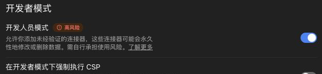
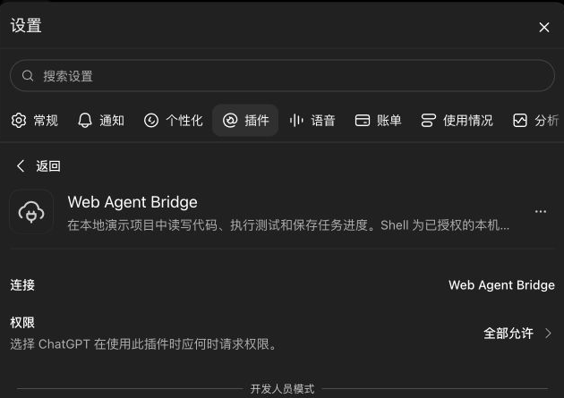

# GPT Web Agent

**New users: [完整中文上手教程：安装 → 连接 → 验收 → 日常使用](docs/GETTING-STARTED.zh-CN.md).**

Each person runs their own instance on their own computer with their own ChatGPT connection and tunnel credentials. Cloning this repository alone does not connect ChatGPT. This is self-hosted source code, not a shared hosted plugin or a plugin-store installation.

## Local paths mode (0.5.5)

Start with `node src/cli.js --dynamic-projects --allow-host-exec` to let the web model discover and work on local projects without registering or switching them. File paths, directory paths, image destinations and command `cwd` accept absolute paths; relative paths use the home directory reported by `workspace_info`. There is no per-call project parameter or mutable global project. All commands share the concurrency limit. Private file names, parent traversal and symlinks remain excluded by file tools; host shell is still unsandboxed. State lives in `~/Library/Application Support/gpt-web-agent/local-state` on macOS or `$XDG_STATE_HOME/gpt-web-agent` (default `~/.local/state/gpt-web-agent`) on Linux; previous fixed-root state is left intact and can be inspected using the old `--root` mode. Existing `--root` mode remains supported.


[中文说明](README.zh-CN.md)

Give a browser-based AI assistant tools to work on a real local project: read code,
edit files, run tests, inspect failures, and keep task checkpoints.

**Status: experimental 0.5.5.** Local MCP integration tests and a live ChatGPT web
code-edit/test/fix workflow pass; see [validation](docs/VALIDATION.md).
Source: [yyyqt/gpt-web-agent](https://github.com/yyyqt/gpt-web-agent).
Not published to npm or the ChatGPT plugin store.

## ChatGPT connection settings

These screenshots show the actual ChatGPT settings used for a private connection. They are cropped to exclude account details and connection IDs. The installed app is named **Web Agent Bridge** on this account; name your own connection as you like. The “Allow all” permission shown here is this account's choice, not a required setting.





For the shortest private ChatGPT setup, install directly from GitHub with
`npm install --global --ignore-scripts https://github.com/yyyqt/gpt-web-agent/archive/refs/tags/v0.5.5.tar.gz`, create your
own Platform tunnel and runtime key, then run `gpt-web-agent connect`. The
command installs the official tunnel-client automatically if absent and checks
its release SHA-256. It configures on first run and starts on every run. See
the [Chinese setup guide](docs/GETTING-STARTED.zh-CN.md) for account steps.

```text
ChatGPT web (reasoning and tool selection)
          │ MCP through a private authenticated tunnel
          ▼
GPT Web Agent (local tool runtime)
          ├─ workspace files + optimistic edits
          ├─ optional host commands + bounded results
          └─ task checkpoints + metadata-only audit log
```

No model inference API, reverse proxy for ChatGPT, browser session extraction,
or scraping of ChatGPT conversations. The runtime itself needs no OpenAI API key.
The optional official tunnel has its own runtime credential and permissions.
This project does **not** promise unlimited tokens or bypass account limits.

## Quick start

Requirements: Node.js 22+, macOS or Linux for shell execution. Use a disposable
project directory for first use. Clone this repository or extract its source archive, then run:

```sh
npm ci --ignore-scripts
npm run check
mkdir -p /tmp/bridge-demo
node src/cli.js --root /tmp/bridge-demo
```

The default transport is MCP stdio: it waits for an MCP client, not terminal input.
It exposes file tools and task checkpoints. Shell tools are absent by default.
To enable command execution:

```sh
node src/cli.js --root /tmp/bridge-demo --allow-host-exec
```

**`--allow-host-exec` gives the assistant unsandboxed host shell access.** Commands
run as the current OS user. `cwd`, blocked file names, and a reduced environment
are not a sandbox: commands can access paths outside the workspace, use the
network, and launch other processes. For stronger isolation, run the entire
runtime in a dedicated unprivileged VM/container. Do not mount secrets or the
Docker socket into that environment. No built-in container integration is claimed.

Connect through [the ChatGPT setup guide](docs/CHATGPT.md). For any stdio MCP
client, adapt [the configuration example](examples/mcp-client.json).

Optional loopback-only HTTP transport:

```sh
node src/cli.js --root /tmp/bridge-demo --transport http --port 8788
```

Endpoint: `http://127.0.0.1:8788/mcp`; health: `/health`. HTTP rejects browser
Origins and unexpected Host headers. It has no public authentication server and
must not be exposed through an unauthenticated public forwarding URL. Use an
access-controlled private tunnel; all trusted local clients share this workspace.

## Tools

| Tool | Purpose |
| --- | --- |
| `workspace_info` | Discover mode, limits, and the execution boundary |
| `list_files` | List one directory |
| `read_file` | Read UTF-8 text and SHA-256 |
| `search_text` | Literal search with file/line evidence |
| `import_image` | Decode, validate and save a real ChatGPT image file reference |
| `patch_file` | Atomic exact-match edits against an expected file hash |
| `read_command_output` | Paginated stdout/stderr with continuation offsets |
| `write_file` | Atomic replace with expected hash; `null` only for creation |
| `list_tasks` / `save_task` | Resume a checkpoint using revision checks |
| `start_command` | Start an opted-in host command, return a job ID |
| `get_command` | Inspect bounded output and final exit status |
| `cancel_command` | Kill the command process group |
| `list_commands` | Find retained jobs after reconnecting |
| `start_codex` | Opt-in local Codex task with existing login and workspace-write sandbox |

`--read-only` removes write/task-save/shell tools. Runtime metadata still writes
to `.web-agent/`. File tools deny parent traversal, secret-like names, `.git`,
symlinks and hard-linked files. Secret detection is deliberately incomplete.

## Background tasks and Codex

Direct execution by the web model is the default. Delegate only when the user explicitly asks for Codex; do not substitute a model CLI through shell. Add `--allow-codex` to expose `start_codex`. Install the official Codex CLI and run
`codex login` first. Prompts go through stdin to `codex exec --ignore-user-config
--sandbox workspace-write`; no shell interpolation or bypass flag. The CLI uses
its existing login and default model, not the global user's MCP/model/hook config.
Project-level Codex policies can still apply. Codex consumes its own account quota.

```sh
node src/cli.js --root /absolute/project --allow-host-exec --allow-codex \
  --max-seconds 7200 --max-output-bytes 1048576 --max-file-bytes 4194304
```

Wait for a job ID before leaving. Already dispatched shell/Codex jobs run without
an open browser while the runtime stays alive. Codex executes its own model/tool
loop. Ordinary ChatGPT cloud-turn completion after tab closure depends on ChatGPT
and pending approvals; this bridge does not guarantee it or start new ChatGPT turns.
Keep the host awake and online. See [background operation](docs/BACKGROUND.md).

Completed results (including bounded output) survive restart in local private
`.web-agent/job-*.json` files. Graceful server shutdown cancels active jobs.
Unfinished records after a crash are reported as `interrupted`, never blindly
rerun or killed using stale PIDs. This is result persistence, not reboot recovery.

Limits are configurable: `--max-seconds` (default 600, up to 86400),
`--max-concurrent` (4, up to 16), `--max-output-bytes` (131072, up to 16777216),
`--max-file-bytes` (1048576, up to 16777216). Both job types share concurrency.
Excess jobs wait in FIFO order; execution timeout starts at launch. Avoid concurrent edits to the same files. Retention: 100 job results,
100 task checkpoints; search visits at most 2000 entries. Truncation is explicit.
PTYs, daemonized child processes, scheduling, browser and SSH modules are not provided.

## Verify the first real workflow

After connecting, use [the demo prompt](examples/acceptance-prompt.md). Confirm
that the assistant calls tools, observes a failing test, corrects the code, runs
it again, and reports the real exit code. Verify the resulting files locally.
A written plan or fabricated terminal transcript does not count as acceptance.

## Development and contribution

```sh
npm ci --ignore-scripts
npm run check
npm audit --omit=dev
npm pack --dry-run
```

Tests cover real stdio/HTTP MCP round trips, a failing-test/fix/passing-test loop,
read-only discovery, path rejection, edit conflicts, task persistence, bounded
output, process cancellation, timeout, and local HTTP request validation.

See [architecture](docs/ARCHITECTURE.md), [security](SECURITY.md), and
[contribution notes](CONTRIBUTING.md). MIT licensed. Independent project, not
endorsed by OpenAI. No source code was copied from AgentDock or the article.

New tools: `import_image` validates and saves ChatGPT file references;
`patch_file` applies hash-checked local replacements; `read_command_output` reads
logs in pages. Use `get_command` with `includeOutput:false` for status-only polling.
See [protocols, limits and image handoff caveats](docs/IMAGES-AND-EDITS.md).
The runtime does not call an image generation API.

0.4.1 also verifies Chat with 6 Pro selected: generate an image, then import the
original from ChatGPT's library with the bridge. The fix admits the two exact
Azure Blob hosts observed in ChatGPT's file handoff; other Azure accounts remain
blocked. Generation/import were verified as separate requests, without manual
file transfer. See the validation record for scope and limitations.

## Public HTTPS option

A separate authenticated option is [under design](docs/PUBLIC-CONNECTION-DESIGN.md). The current localhost HTTP endpoint must not be forwarded to the public internet.
