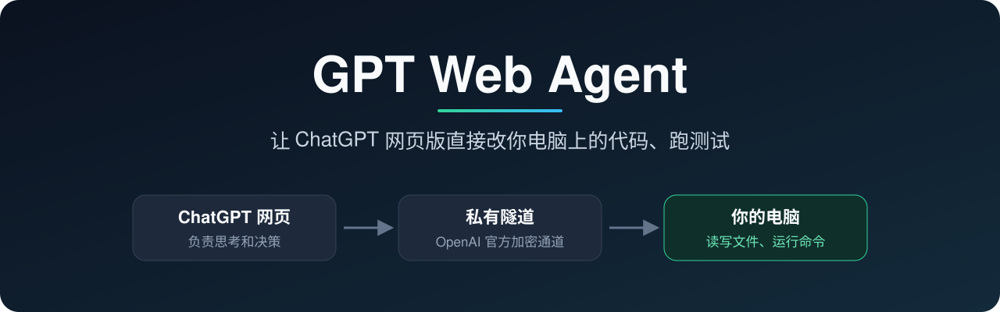

<p align="center">
  
</p>

<p align="center">
  <a href="https://www.npmjs.com/package/gpt-web-agent"></a>
  <a href="https://github.com/yyyqt/gpt-web-agent/actions/workflows/ci.yml"></a>
  
  
  <a href="LICENSE"></a>
</p>

<p align="center">
  <b>中文</b> · <a href="README.md">English</a> · <a href="docs/GETTING-STARTED.zh-CN.md">带截图的上手教程</a>
</p>

---

## 这是什么？

平时用 ChatGPT 写代码，是它给你一段代码，你复制、粘贴、运行，再把报错贴回去。

**GPT Web Agent 把这一步省掉了。** 在你电脑上装好它，ChatGPT 网页版就能直接读你的项目、改文件、跑测试，改完告诉你结果。你只需要在聊天框里说话：

```text
你：  看看我的 blog 项目有什么可以优化的，先只分析。
GPT： [读取 package.json、src/…] 发现 3 个问题：① 首页图片没压缩 ② ……
你：  修第一个，改完跑一下测试。
GPT： [修改 src/image.js] [运行 npm test] 测试通过。改动了 2 个文件：……
```

它是一个运行在你电脑上的小程序（MCP 服务），通过 OpenAI 官方的私有隧道和你的 ChatGPT 连接。**ChatGPT 负责思考，这个程序负责在你的电脑上动手。**

## 为什么用它？

|  | 复制粘贴 | GPT Web Agent |
| --- | --- | --- |
| 改代码 | 你手动复制粘贴 | GPT 直接改文件 |
| 跑测试 | 你运行，再把报错贴回去 | GPT 自己跑，自己看结果 |
| 看项目 | 你挑文件贴给它 | GPT 自己去找、去读 |
| 生成的图片 | 手动下载再挪位置 | 一句话存到项目指定目录 |

- **用你现有的 ChatGPT**：本项目不调用任何模型 API，不额外按 token 计费，也不需要装 Codex 等其它 AI 工具。
- **不绑项目**：说一句“再看看 YYY 项目”就切过去了，不用登记路径。
- **不会误覆盖**：写文件前校验内容指纹（SHA-256），文件在这期间被你改过就拒绝覆盖。
- **关网页也不中断**：已经开始的测试、构建会在电脑上继续跑，回来再问结果。
- **不碰你的账号**：不代理 ChatGPT、不读取浏览器 Cookie，只走 OpenAI 官方隧道。


## 快速开始

> [!IMPORTANT]
> 请用**个人**账户，并先确认两件事：ChatGPT「设置 → 账户安全与登录」里有**开发者模式**；[Platform → Tunnels](https://platform.openai.com/settings/organization/tunnels) 里能点 **Create tunnel**。ChatGPT 订阅不等于有隧道权限；公司或学校账户通常要管理员开通。

**1. 安装**（需要 Node.js 22+，支持 Mac、Linux 和原生 Windows）

```sh
npm install --global gpt-web-agent@latest
```

Windows PowerShell：

```powershell
npm.cmd install --global gpt-web-agent@latest
gpt-web-agent.cmd --help
```

升级旧版也使用上面的安装命令；`gpt-web-agent --help` 应显示 0.6.0 或更高。升级后重启连接，已有隧道和 key 配置会保留。

**2. 在 OpenAI Platform 创建隧道和 key**

- [Tunnels](https://platform.openai.com/settings/organization/tunnels) → **Create tunnel**，关联你的 ChatGPT 工作区，复制 `tunnel_...` ID。
- [API keys](https://platform.openai.com/settings/organization/api-keys) → **Create new secret key**，权限选 **Restricted**，只给 **Tunnels** 勾 **Read** 和 **Use**。

**3. 在电脑上连接**

```sh
gpt-web-agent connect
```

Windows PowerShell 用 `gpt-web-agent.cmd connect`。

按提示粘贴隧道 ID 和 key；想让 GPT 跑测试，就在第二个问题输入 `YES`。看到 `tunnel-client started` 后保持终端开着。以后每次开机都只运行这一条命令。

**4. 在 ChatGPT 添加连接**

打开开发者模式 → [插件页](https://chatgpt.com/plugins) 点 **+ → 创建应用 → 创建 MCP 应用** → 连接选**隧道**，身份验证选**无身份验证**，勾选风险确认 → 创建。新建聊天，在输入框旁的 **+** 里选中它，就可以开始了。

每一步的页面截图、成功标志和排错，见 **[上手教程](docs/GETTING-STARTED.zh-CN.md)**。

## 它能做什么

| 能力 | 说明 |
| --- | --- |
| 浏览和搜索 | 列目录、读文件、全文搜索 |
| 修改文件 | 新建、整体改写或局部补丁，写入前校验防止覆盖 |
| 运行命令 | 跑测试、构建、装依赖；可查看进度、超时和取消（需在配置时开启） |
| 保存图片 | 把网页里生成或上传的图片原样存进项目 |
| 任务记录 | 多步任务的进度检查点，重新连接后还能接着看 |
| 委托 Codex | 可选：你明确要求时，把任务交给本机 Codex 执行 |

## 安全须知

> [!WARNING]
> 开启“运行命令”后，GPT 执行的命令和你自己在终端里敲的**权限一样大**，不是沙箱。只在自己的连接里使用；处理敏感项目时，可以不开启命令，只用文件读写。

- 运行 key 存在 macOS 钥匙串、Linux 系统密码库，或由 Windows DPAPI 按当前用户加密保存；不会以明文写进配置文件或仓库。
- 连接只通过 OpenAI 官方私有隧道，不在公网开放端口。**不要**自己把本地服务映射到公网。
- 更多细节见[安全说明](SECURITY.md)。

## 常见问题

<details>
<summary><b>需要付费吗？</b></summary>

本项目免费开源，也不调用模型 API。你需要能开启开发者模式的 ChatGPT 账户，以及 OpenAI Platform 的隧道权限；隧道相关费用以 OpenAI 账户页面显示为准。
</details>

<details>
<summary><b>Windows 能用吗？</b></summary>

支持原生 Windows。命令执行使用 Windows PowerShell，隧道 key 使用 DPAPI 加密，并下载 OpenAI 官方 Windows 版 tunnel-client。原生 Windows 暂不支持本地 Codex 委托和 `install-service`，但这不影响网页读写文件、执行命令和跑测试。
</details>

<details>
<summary><b>关掉终端或电脑休眠会怎样？</b></summary>

连接会断开，ChatGPT 暂时调不到工具。重新运行 `gpt-web-agent connect` 即可。Mac 上可以用 `gpt-web-agent install-service` 设置登录后自动连接。
</details>

<details>
<summary><b>GPT 只给方案、不动手？</b></summary>

这条聊天没选中连接。点输入框旁的 **+**，搜索你创建的连接名并选中，再让它先调用 `workspace_info` 试试。
</details>

<details>
<summary><b>key 过期了怎么办？</b></summary>

在 Platform 新建一个 key，运行 `gpt-web-agent set-key` 粘贴，再重新运行 `gpt-web-agent connect`。
</details>

更多问题见[上手教程的排错表](docs/GETTING-STARTED.zh-CN.md#遇到问题)。

## 文档

- [上手教程（带截图）](docs/GETTING-STARTED.zh-CN.md)
- [Windows 使用与双电脑连接](docs/WINDOWS.md)
- [图片导入与局部补丁](docs/IMAGES-AND-EDITS.md)
- [技术参考](docs/REFERENCE.zh-CN.md) · [架构](docs/ARCHITECTURE.md) · [后台运行](docs/BACKGROUND.md)
- [安全说明](SECURITY.md) · [验证记录](docs/VALIDATION.md) · [贡献指南](CONTRIBUTING.md)

## 许可

[MIT](LICENSE)
