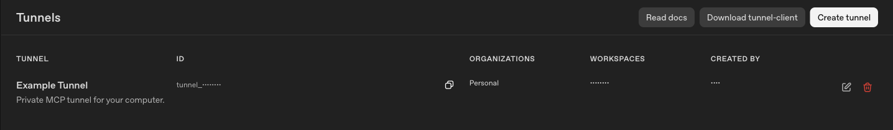
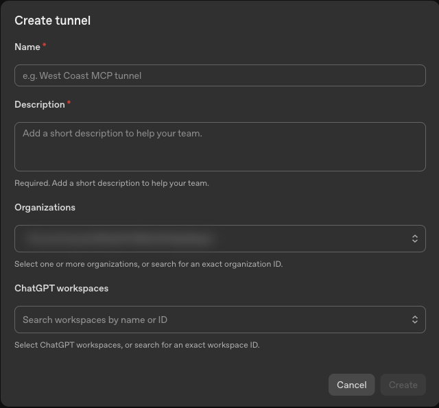
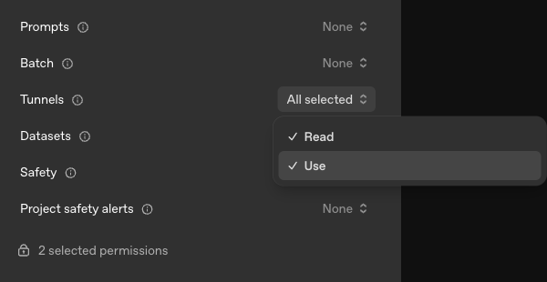
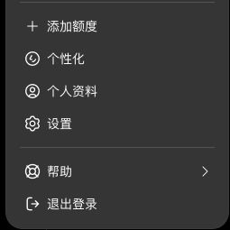
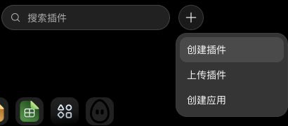
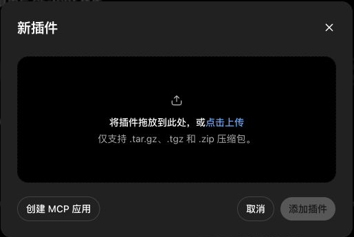
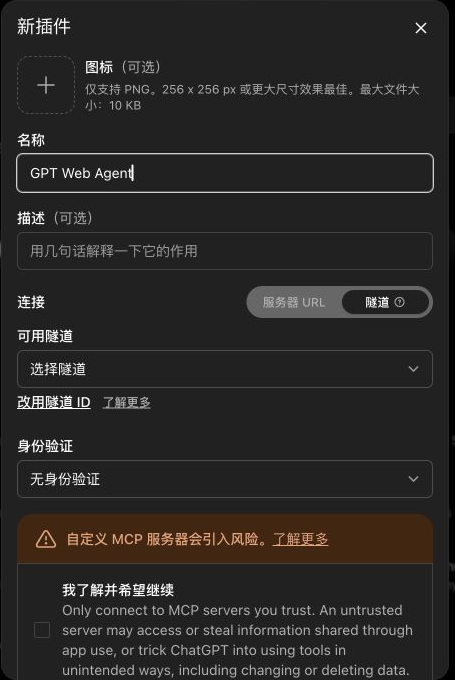
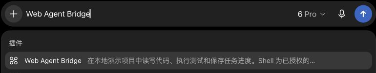

# Getting started: let ChatGPT on the web work on your own computer

When you finish this guide, you can tell ChatGPT "find my XXX project, fix it and run the tests", and it will edit files and run tests directly on your computer.

**Everyone installs this on their own computer and connects with their own account.** You don't need an account from the author, and nothing connects to anyone else's computer.

**You need:**

- A Mac, Linux, or Windows computer.
- A **personal** ChatGPT account, and [OpenAI Platform](https://platform.openai.com/) signed in with the same account.
- About 15 minutes.

> Use a **personal account**. On company or school ChatGPT accounts, an admin usually has to enable developer mode and tunnels, and a tunnel created in your personal Platform organization won't automatically show up in a company ChatGPT workspace. [Official notes](https://developers.openai.com/api/docs/guides/secure-mcp-tunnels#permissions-and-access)

**Before installing, open [Platform → Tunnels](https://platform.openai.com/settings/organization/tunnels) and check whether you can create a tunnel.** A ChatGPT subscription does not itself grant tunnel access. If **Create tunnel** is unavailable, resolve the account or organization permission first; the steps below cannot finish yet.

The screenshots below were taken in the Chinese ChatGPT interface; the English button names are given in the text.


## 1. Open a terminal and install the program

On a Mac, press **Command (⌘) + Space**, type **Terminal**, and press Return. On Linux, open your system's terminal. On Windows, open **Windows PowerShell** from the Start menu.

Type this and press Return to check whether Node.js is installed:

```sh
node --version
```

If it shows `v22` or higher, continue. If it says "command not found", "not recognized", or the version is lower, install Node.js first: on a Mac with Homebrew, run `brew install node`; otherwise follow the [Node.js download page](https://nodejs.org/en/download). After installing, **close the terminal, open a new one**, and check again.

Then copy this whole command into the terminal and press Return to install the program:

```sh
npm install --global gpt-web-agent@latest
```

Windows PowerShell:

```powershell
npm.cmd install --global gpt-web-agent@latest
gpt-web-agent.cmd connect
```

Use the same install command to upgrade. `gpt-web-agent --help` should report 0.6.0 or newer. Restart the connection after upgrading; existing tunnel and key configuration is preserved.

Finally run `gpt-web-agent --help`. If you see a list of commands, **the install worked**. ChatGPT is not connected yet.

> If the install fails with `EACCES` or "permission denied": **don't use `sudo`**. It means Node was installed into a system folder. Reinstall Node with Homebrew or the method recommended on the Node.js download page, then try again.

## 2. Create a tunnel and a key in OpenAI Platform

This step happens in the browser. You'll get two things:

- **Tunnel ID**: a code starting with `tunnel_`. The tunnel is a private channel from ChatGPT to your computer.
- **Runtime key**: a secret starting with `sk-`. Your computer uses it to prove "I own this tunnel".

**Create the tunnel:** open [Platform → Tunnels](https://platform.openai.com/settings/organization/tunnels) and click **Create tunnel** in the top right.



Use any name and description (for example "My computer"). Under **Organizations**, pick your own (usually called Personal). Under **ChatGPT workspaces**, pick the ChatGPT account you normally use. Click **Create**.



Back in the list, click the copy button next to the **ID** and keep the `tunnel_...` handy.

**Create the runtime key:** open [Platform → API keys](https://platform.openai.com/settings/organization/api-keys) and click **Create new secret key** in the top right.

- Choose a project and expiry as the form asks.
- Set **Permissions** to **Restricted**.
- Scroll down to **Tunnels** and select only **Read** and **Use**. Leave everything else at **None**.



After you create it, the page shows the key. **It is usually shown only once**, so keep the page open; you'll paste it in the next step. Never paste the key into a chat, GitHub, or anywhere public.

## 3. Run `connect` in the terminal

Back in the terminal, run:

```sh
gpt-web-agent connect
```

It asks you three things, in this order:

1. **Tunnel ID**: paste the `tunnel_...` from step 2 and press Return.
2. **Allow GPT to run commands on this computer?** If you want GPT to run tests or install dependencies, type `YES` in capitals and press Return. If you only want it to read and write files, just press Return.
   Commands GPT runs have the same power as commands you type in your own terminal. Only use this with your own connection.
3. **Runtime key**: paste the `sk-...` from step 2 and press Return. **Nothing appears on screen while you paste; that's normal.** The key is stored in the macOS Keychain, the Linux system password store, or a Windows DPAPI CurrentUser-encrypted file, so you won't need to type it again.

On the first run it automatically downloads OpenAI's official tunnel program and verifies the file. A successful run looks roughly like this (some log lines omitted):

```text
Your own tunnel_... ID: [paste your own ID]
Downloading the official OpenAI tunnel-client and checking SHA-256...
Enable host shell commands? ... Type YES to enable: YES
Paste tunnel runtime key (hidden), then Enter:
Configured. Starting the tunnel now...
...
"msg":"🟢 tunnel-client started"
```

When you see **`tunnel-client started`**, your computer is ready. **Keep this terminal window open**; closing it disconnects ChatGPT.

From now on, after restarting your computer, open a terminal and run the same `gpt-web-agent connect`. You won't be asked anything again.

## 4. Add your connection in ChatGPT

**Turn on developer mode:** in [ChatGPT](https://chatgpt.com/), click your profile picture in the bottom left → **Settings**.



On the left, choose **Security and login**, scroll down, and turn on **Developer mode**.


**Create the connection:** open the [ChatGPT plugins page](https://chatgpt.com/plugins) and click the **+** next to the search box → **Create app** (not "Create plugin").



In the window that opens, click **Create MCP app** in the bottom left.



Fill in the form like this:

- **Name**: `GPT Web Agent` (or any name; you'll search for it later).
- **Connection**: choose **Tunnel**, then pick the tunnel from step 2 under available tunnels. If it isn't listed, switch to entering the tunnel ID and paste the `tunnel_...`.
- **Authentication**: choose **No Authentication**. This uses a private tunnel controlled by OpenAI organization and ChatGPT workspace permissions; it does not expose an unauthenticated local server to the public internet. Do not associate the tunnel with an untrusted workspace.
- Tick the risk acknowledgement checkbox at the bottom, then click **Create**.



After it's created, go to **Settings → Plugins** and open your new connection to see its read and write tools. Look for **Workspace info**, **Read file** and **Write file**; **Start command** should also be available if you typed `YES` in step 3. The interface may show names with spaces rather than code-style underscores. If there are no tools at all, check that the terminal from step 3 is still running and refresh the connection.

**Select it in a chat:** start a new chat, click the **+** on the left of the message box, type the name you chose (for example GPT Web Agent), and click it under plugins. Once its label appears in the message box, send your message.



## 5. Check that it really reaches your computer

In a chat with the connection selected, send:

> Call workspace_info and tell me which folder you're connected to and whether you can run commands. Then list the first 10 items in my Documents folder. Only look; don't change any files.

**Success looks like this:** GPT actually calls the tool, reports **your own home folder**, and lists files that match what's on your computer. If it only explains steps without calling a tool, the chat doesn't have the connection selected; go back and select it.

If you typed `YES` in step 3, send this for a full test:

> In my Documents folder, create a new folder named gpt-web-agent-demo with a timestamp. Put a JavaScript function with an addition bug and a matching test in it, run the test and tell me the failure; then fix it, run the test again, and tell me the final result and the folder's full path. Only touch this new folder. Don't commit, push or deploy.

Open that folder on your computer. If the files are there and the final test passed, you're done.

## Everyday use

After starting your computer, run `gpt-web-agent connect` and keep the terminal open. In ChatGPT, select your connection in the chat and just talk normally:

- "Look at my XXX project and tell me what could be improved. Analysis only for now."
- "Fix the first issue you mentioned and run the tests. Keep my existing changes; don't commit or deploy."
- "Now look at the YYY project." (No need to give a path; it finds it and asks if unsure.)
- "Save the original of the image you just generated to public/images/example.png in the XXX project." (Generate the image first, then ask to save it.)

Your computer must be on and online, and the terminal must stay open. Closing the web page doesn't stop commands already running on your computer.

### Choosing between Mac and Windows

Use a separate tunnel ID and ChatGPT connection for each computer, such as `GPT Web Agent — Mac` and `GPT Web Agent — Windows`. Run `connect` on each host with its own configuration; do not use a shared tunnel as a host switch. Separate runtime keys also make rotation easier. Tunnels Read/Use permissions alone do not scope a key to one particular tunnel.

Start a ChatGPT conversation and select the target connection from the **+** menu beside the message box. Prefer separate Mac and Windows conversations, each with only one machine connection selected. Saying “switch to Windows” does not change the selected connection for you. Select it first, then call `workspace_info` and check `platform` (`win32` for Windows, `darwin` for Mac) and the workspace path before editing. Older Mac runtimes may not return the platform field; verify the workspace or upgrade first. Both computers can stay connected at once; switching does not require stopping the other host, but an offline host is unavailable.

See the official [connection testing guide](https://developers.openai.com/plugins/deploy/connect-chatgpt) and [private tunnel guide](https://developers.openai.com/api/docs/guides/secure-mcp-tunnels).

### Optional extras

- **Connect automatically at login (Mac only)**: run `gpt-web-agent install-service`, then copy and run the `launchctl` command it prints. After that it connects every time you log in, with no terminal needed. For Linux, see [running in the background](BACKGROUND.md).
- **Replace the key**: if the key expires or you want a new one, run `gpt-web-agent set-key`, paste the new key, then run `connect` again (if you use automatic connection, restart your computer).
- **Hand work to local Codex (macOS/Linux)**: by default the GPT in the web page does the work itself. If you've installed and signed in to Codex, see the [technical reference](REFERENCE.md) to enable delegation. Native Windows does not expose this optional tool yet.

### Troubleshooting

| What you see | What to do |
| --- | --- |
| No developer mode, or no Create tunnel in Platform | Check account and organization permissions; ask your admin for a company or school account. A personal ChatGPT subscription does not guarantee Platform tunnel access |
| Your tunnel isn't in ChatGPT's list of tunnels | When creating the tunnel, **ChatGPT workspaces** must be the ChatGPT account you're using; or enter the tunnel ID directly |
| Terminal says `gpt-web-agent: command not found` | Close and reopen the terminal; if it still fails, rerun the install command from step 1 and look for errors |
| The terminal exits with an error | Run `gpt-web-agent connect` again; if it says the key is invalid, run `gpt-web-agent set-key` |
| GPT only explains steps and doesn't act | The chat doesn't have your connection selected: click **+** next to the message box, select it, and ask it to call `workspace_info` first |
| Can't connect after restarting the computer | Run `gpt-web-agent connect` again |
| Saving an image fails | See [images](IMAGES-AND-EDITS.md) |
